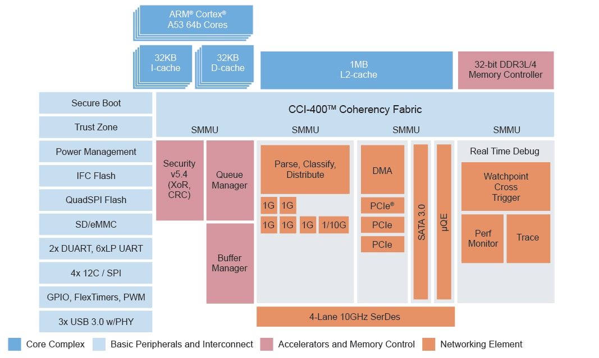
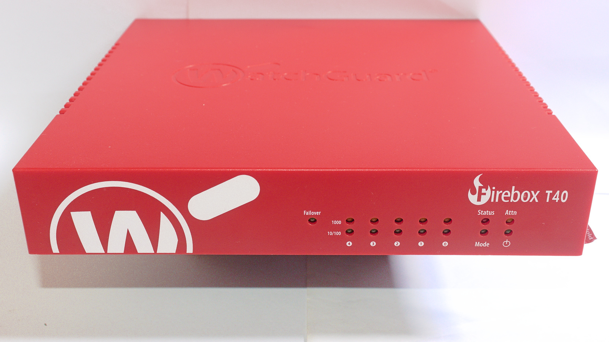
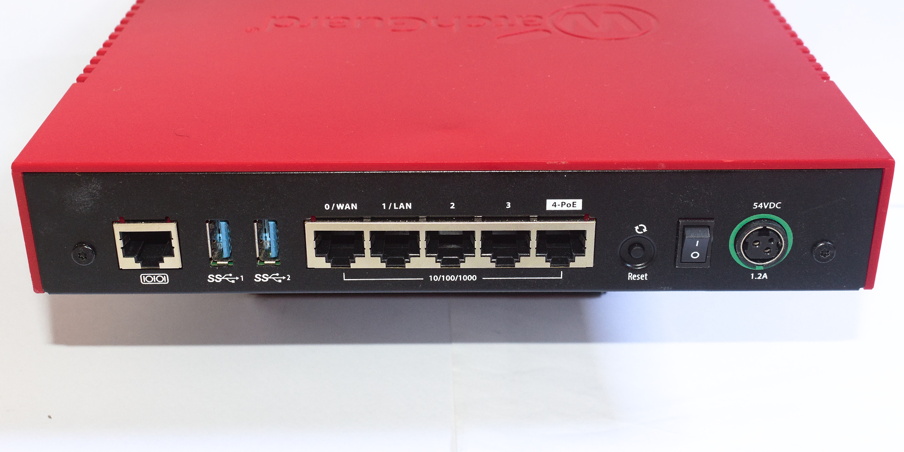
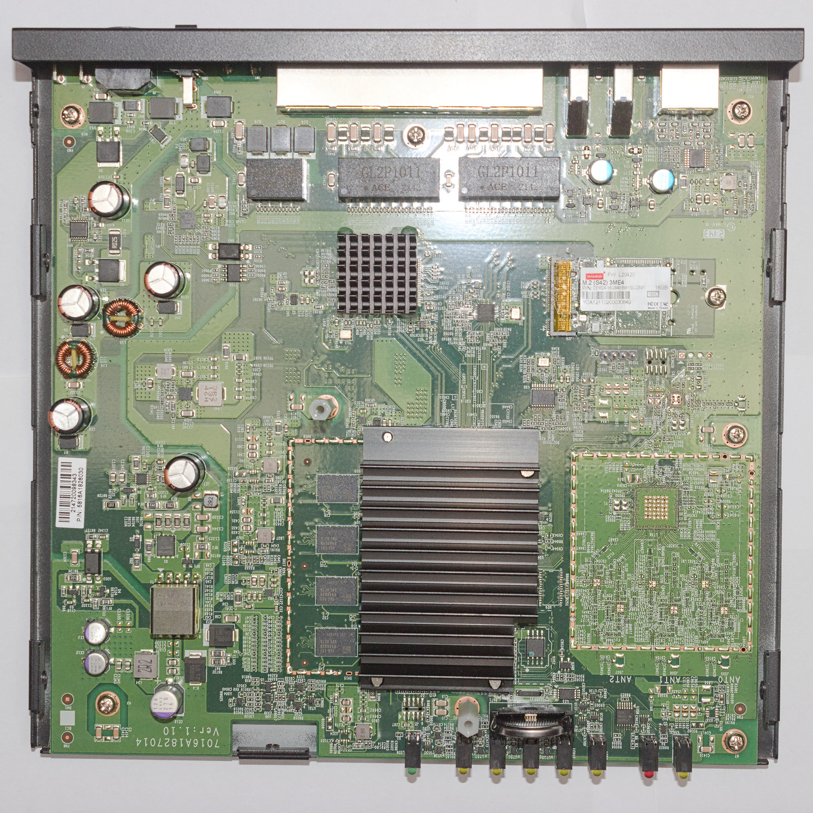
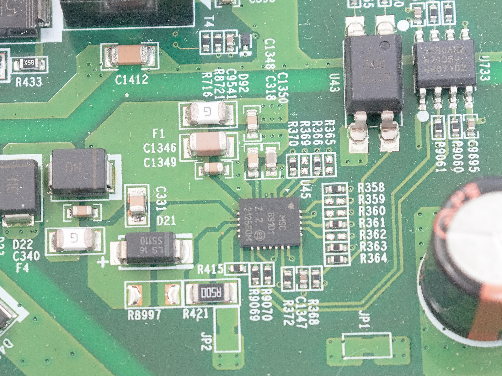
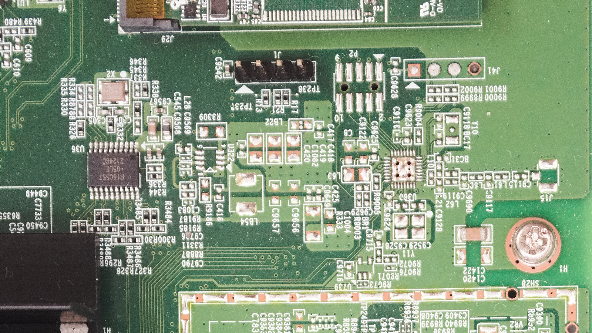
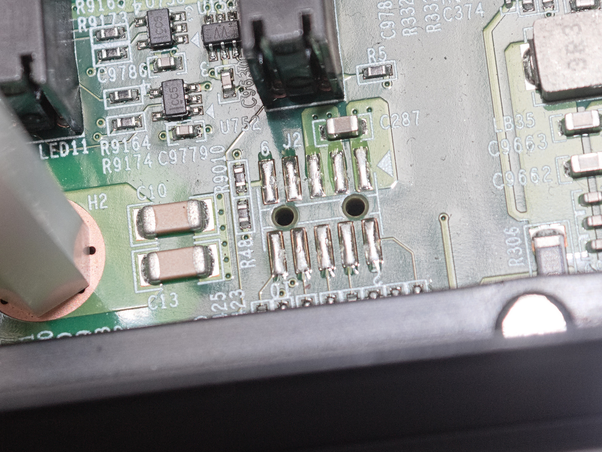

+++
date = '2026-06-14T14:45:00-03:00'
draft = false
title = 'WatchGuard Firebox T40 notes'
+++

This blog post is meant as a companion to the [guide](https://github.com/victhor393/watchguard-t40/wiki) I wrote, detailing the efforts I took documenting the WatchGuard Firebox T40 appliance. For more technical information on the device itself and also on how to run a Linux distribution of your liking on it, check the guide above.

# Introduction

One thing that's fascinating to me in the ARM world is NXP's Layerscape family of networking systems on a chip. Complex peripherals, fast external interfaces, it's quite amazing.



I've been wondering what they're like to use. They are also well supported by upstream Linux and U-Boot, plus feature extensive publically available documentation, making it a very interesting proposition.

However, the unit pricing for these SoCs is really high, which precludes any cheap single-board computers - at the time of writing, NXP quotes between $40-80 per unit, at volumes of either 100 or 10k units per order, which is around the price of a decent SBC, for the SoC alone!

So that leaves us with mass-produced appliances, like enterprise routers and firewalls. SoCs like this are, unfortunately, often too expensive for consumer routers.

However, my options were limited. It's hard to find information on networking products in general. Hardly any companies volunteer information as to what's inside them, and the hardware is just too expensive, brand new, for people to take a screwdriver to them and see what's inside. Or, maybe they don't find the boot logs to be interesting enough to post online.

You are left with volunteer efforts such as the former WikiDevi, and its offshoots, like TechInfoDepot, wikidevi.wi-cat.ru, that catalogue specifications for such devices.

# The Device Itself

In the end, after a little searching, I decided on the WatchGuard Firebox T40. It had a LS1043A SoC, so it wasn't too underpowered, 4 GB of RAM (!), a SATA SSD and a very convenient form factor - just a flat-topped box with compact dimensions and ports on the back side. Sadly, no 10 gigabit Ethernet - seems to be a rare feature for firewall appliances in general.





One concern I had was that there was no information at all about these devices, when I started looking for them, other than specs on wikis and the manufacturer's site (which, fortunately, does provide specs such as the SoC, RAM and storage). No boot logs, no blog posts about it, no OpenWrt ports, absolutely nothing.

This concern leads to another - secure boot. The Layerscape platform is equipped with "QorIQ Trust Architecture", which encompasses a wide variety of security features, including secure boot, which would prevent software modification by the end user. My concern wasn't unfounded, as I knew [Meraki](https://forum.openwrt.org/t/cisco-meraki-mx68w/134895/12) implemented secure boot in their platforms, even though they did not take advantage of the SoC's features, and instead rolled their own implementation.

I was flying blind. Even if I bought one used, it could be a potentially expensive dud. Fortunately for me, they are not worth very much; my unit, a Firebox T40 (wired model) was purchased used, on eBay, with the power supply included, for $17.99 shipped. A good deal, in my eyes.

With the hardware in hand, I eventually got around to documenting what exactly was inside the box.

# Inside the case

The case is reasonably well built. It's half plastic, half metal, but it feels fairly solid. Held together by four screws.



The board is very cleanly laid out, and we can make out a large power supply section (isolated, too), memory, the SoC and RAM, a large Ethernet PHY, a M.2 2242 SSD and the unpopulated wireless controller.

Specs for this device are:

* NXP Layerscape LS1043A SoC (4x ARM Cortex-A53, 1 GHz)
* 4 GB DDR4 RAM (Samsung K4A8G085WC-BCTD, DDR4-2666) organized in a 32 bit bus
* 4 MB NOR flash, SPI (Macronix MX25U3232F)
* an empty spot for a Wi-Fi controller, soldered directly to the PCB
* M.2 2242 slot with a 16 GB SATA SSD (Innodisk M.2 (S42) 3ME4)
* 5 gigabit Ethernet ports, one with a PoE output
* 2 USB 3.0 ports

Fairly decent for $18, plus it included a case, a power supply and storage, which most SBCs don't include, as well as a large heatsink for the SoC. Though the case doesn't offer much airflow, this is somewhat remediated by sinking heat to its metal half through a thermal pad. M.2 2242 is a rather inconvenient size for the SSD. I believe it's popular in Lenovo laptops and not much else, unlike the more common 2230 and 2280 sizes.

There is no switch inside - unlike what one might initially assume, this device actually has 5 completely independent network ports, a very unusual choice. The LS1043A is based around the "Data Path Acceleration Architecture 1", which, according to NXP documentation, isn't capable of layer 2 switching.

# Initial investigation

After powering on the device, I saw that the stock U-Boot bootloader had quite a verbose output. I suppose it was not heavily modified from the LSDK shipped by NXP.

```
U-Boot 2018.09 (Dec 05 2019 - 10:13:47 -0800)

SoC:  LS1043AE Rev1.1 (0x87920011)
Clock Configuration:
       CPU0(A53):1000 MHz  CPU1(A53):1000 MHz  CPU2(A53):1000 MHz  
       CPU3(A53):1000 MHz  
       Bus:      300  MHz  DDR:      1600 MT/s  FMAN:     500  MHz
Reset Configuration Word (RCW):
       00000000: 0610000a 0a000000 00000000 00000000
       00000010: 45580002 00000012 40044000 c1002000
       00000020: 00000000 00000000 00000000 0003fffe
       00000030: 20004504 0418320a 00000096 00000001
```

Checking the SoC ID (the hex number next to the SoC model), this is a "security enabled" part, which means it has secure boot, crypto acceleration, etc. available. That's not a very good sign.

The second clue was more definitive: the reset configuration word (RCW). The RCW is part of the boot image's header, and has a purpose similar to pin-strapped boot ROM options on other SoCs - to configure various aspects of the very complex SoC before the boot ROM can load the second stage bootloader (U-Boot).

In this SoC, the RCW is a 512-bit long bit field structure, quite difficult to decode by hand. According to the reference manual, field 202 is what I'm interested in: "secure boot enable".

It can be found at the third bit (in big-endian order!) of byte 0x19. It is set to "0", so, secure boot is **not** enabled and we can go forwards!

However, there's still the issue of whether or not U-Boot checks for a valid image signature during boot. Sadly, this is where I hit my first snag - after figuring out you are supposed to not just press "any" key to enter the console, but rather, press Ctrl-C...

```
               WatchGuard U-Boot 2018.09 - Dec 05 2019 10:13:47

 +-------------------------------------------------------------------------+
 |WatchGuard (SYSA)                                                        |
 |WatchGuard (SYSB Recovery/Diagnostic Mode)                               |
 |                                                                         |
 |                                                                         |
 |                                                                         |
 |                                                                         |
 |                                                                         |
 |                                                                         |
 |                                                                         |
 |                                                                         |
 |                                                                         |
 +-------------------------------------------------------------------------+

      Use the ^ and v keys to select which entry is highlighted.
      Press enter to boot the selected OS.


password>
```

A password? I've never seen that before... but this is a common feature in WatchGuard products, documented in the [OpenWrt port](https://lists.infradead.org/pipermail/lede-commits/2023-March/017537.html) for the Firebox T10.

Seeing as we have no secure boot, it should be possible to patch this password, just as the author of the T10 port described. While having to open the case to install another OS is an inconvenience, it could be much worse.

# Searching for the password

I dumped the SPI flash and decompiled the binary with Ghidra. Seems like a bit of an exaggeration, given that U-Boot is open source, but I didn't have the GPL source code for it at the time (in fact, WatchGuard doesn't make it publically available, and I never requested it, either) and it would be good practice, after spending a whole day [trying to find a BIOS password for another appliance](https://forums.servethehome.com/index.php?resources/silver-peak-aruba-unity-edgeconnect-ec-xs-fwa-asp1012-sd-wan-appliance.61/).

This time, however, it didn't take nearly as long, only a few hours. I was able to quickly figure out which function printed out the "password" prompt and, from there, I located the functions that compared the input hash's value with the stored value (hardcoded), just as it was described in the T10's OpenWrt port. The hash was 20 bytes long, so a SHA-1 hash, just as the T10.

From there (and after finding out that I had set Ghidra's data endianness to the wrong value) I was able to patch the bootloader binary with a password I knew ("1234") and thus get into the U-Boot prompt.

Curiously, WatchGuard still uses the same password on this T40 as the comparatively ancient T10, the hash is the same, though I'm not interested in burning electricity bills or GPU cloud credits just to crack an (relatively) easily bypassable password...

# Device tree construction

So, I had access to the bootloader. However, I don't have anything to boot! The problem is, the stock OS in this device is most likely based around the NXP LSDK downstream kernel, so, in all likelihood, I can't just boot an upstream kernel, as used by `aarch64` distributions, typically. The device trees likely have some incompatibility that would make it impossible.

(Side note: the device tree in the stock firmware could boot an upstream kernel to a login prompt over serial, but I believe it isn't fully compatible, there are a few differences that I did not take notes of)

The device had no less than 3 device tree files: one as part of the U-Boot binary, and two in the SSD. Out of these, the U-Boot device tree was incomplete, and one of the device trees on the SSD had some differences from the actual hardware in the device (I believe the MDIO addresses for the quad PHY were different), and one of them was a match.

During initial bringup, I hadn't found those other device tree files yet, so I relied on the U-Boot device tree, plus information garnered from U-Boot commands, to write a device tree for the upstream kernel that could boot the device to a console. Or so I thought...

# Booting from USB

Now that I had the U-Boot console accessible, I figured I'd try the obvious and flash an `aarch64` live ISO to a USB drive and try booting from USB. However, this is where I hit my second snag!

After checking the U-Boot environment with `printenv`, I figured out this U-Boot was new enough to support UEFI images and USB was available. The command seemed to be `run bootcmd_usb0`, so I went ahead and typed it in.

```
Found EFI removable media binary efi/boot/bootaa64.efi
libfdt fdt_check_header(): FDT_ERR_BADMAGIC
Scanning disk esdhc@1560000.blk...
Disk esdhc@1560000.blk not ready
Scanning disk usb_mass_storage.lun0...
Disk usb_mass_storage.lun0 not ready
Scanning disk usb_mass_storage.lun1...
Found 3 disks
WARNING: SEC firmware not running, no kaslr-seed
WARNING: Missing crypto node
couldn't find /cpus node
WARNING failed to get smmu node: FDT_ERR_NOTFOUND
WARNING: fdt_path_offset can't find path /soc/msi-controller1@1571000: FDT_ERR_NOTFOUND
WARNING: fdt_path_offset can't find path /soc/msi-controller2@1572000: FDT_ERR_NOTFOUND
WARNING: fdt_path_offset can't find path /soc/msi-controller3@1573000: FDT_ERR_NOTFOUND
WARNING: fdt_getprop can't get interrupt-map from node /soc/pcie@3400000
WARNING: fdt_getprop can't get interrupt-map from node /soc/pcie@3500000
WARNING: fdt_getprop can't get interrupt-map from node /soc/pcie@3600000
WARNING failed to get smmu node: FDT_ERR_NOTFOUND
1069696 bytes read in 53 ms (19.2 MiB/s)
libfdt fdt_check_header(): FDT_ERR_BADMAGIC
WARNING: SEC firmware not running, no kaslr-seed
WARNING: Missing crypto node
couldn't find /cpus node
WARNING failed to get smmu node: FDT_ERR_NOTFOUND
WARNING: fdt_path_offset can't find path /soc/msi-controller1@1571000: FDT_ERR_NOTFOUND
WARNING: fdt_path_offset can't find path /soc/msi-controller2@1572000: FDT_ERR_NOTFOUND
WARNING: fdt_path_offset can't find path /soc/msi-controller3@1573000: FDT_ERR_NOTFOUND
WARNING: fdt_getprop can't get interrupt-map from node /soc/pcie@3400000
WARNING: fdt_getprop can't get interrupt-map from node /soc/pcie@3500000
WARNING: fdt_getprop can't get interrupt-map from node /soc/pcie@3600000
WARNING failed to get smmu node: FDT_ERR_NOTFOUND
## Starting EFI application at 81000000 ...
"Synchronous Abort" handler, esr 0x96000021
elr: 0000000040108bc0 lr : 0000000040108bb8 (reloc)
elr: 00000000fbd3dbc0 lr : 00000000fbd3dbb8
x0 : 0000000000000000 x1 : 0000000000000000
x2 : 00000000fbd35000 x3 : 000000000000000f
x4 : 00000000fbd3d000 x5 : 000000000000001c
x6 : ffffffffffffffff x7 : 0000000000000000
x8 : 00000000fbdc2560 x9 : 000000000000000c
x10: 000000000a200023 x11: 0000000000000002
x12: 0000000000000002 x13: 0000000000000200
x14: 0000000000000000 x15: 00000000fbd374c4
x16: 0000000000000018 x17: 0000000000000042
x18: 00000000fbc30d48 x19: 0000000000000000
x20: 0000000000000104 x21: 00000000fbc3bb90
x22: 0000000081000000 x23: 00000000fbdd618c
x24: 0000000000000003 x25: 00000000fbc7cd10
x26: 0000000000000000 x27: 0000000000000000
x28: 0000000000000000 x29: 00000000fbd3dbb4

Resetting CPU ...
```

So, as it turns out, the EFI implementation is broken, you can't just boot any live image you want, unlike most `aarch64` devices. However... syslinux boot is still a possibility.

I chose to build an openSUSE image using KIWI-ng, as I was very familiar with the distribution and had already documented the image build process for a different board, including the steps required to build an image that will boot with the syslinux method.

In the end, it worked, and I got the image to boot, but the USB drive wasn't detected...

# More difficulties

I didn't expect to be much trouble with this LS1043A SoC. It was well-supported by the upstream kernel, maintained by the manufacturer, NXP, I couldn't imagine that there were any showstopper bugs...

However, the USB controller kept failing to initialize. The main clue was this message on the kernel log:

`xhci-hcd xhci-hcd.0.auto: Error while assigning device slot ID: Command Aborted`

It took many hours of searching, but I eventually traced this to some kind of incompatibility or bug in the `dwc3` driver.

NXP introduced a [change](https://lore.kernel.org/linux-devicetree/20191121024206.32933-2-ran.wang_1@nxp.com/) to make the SoC fully "DMA-coherent" (meaning that the peripherals can do cache snooping to prevent the CPUs from reading cached data when reading from memory) in the device tree and this change, somehow, caused the driver to stop working.

(Un)fortunately, I wasn't the [only one](https://community.mnt.re/t/no-keyboard-input-with-ls1028-board-and-latest-image/1994) who experienced this [problem](https://www.spinics.net/lists/kernel/msg6010121.html), and since a workaround was documented, I implemented it (deleting the `dma-coherent` property from the top `soc` node and the `usb` peripheral nodes on the `fsl-ls1043a.dtsi` file) and this got me to a... kernel panic!

This time, the OP-TEE driver caused a CPU SError (ARM equivalent of a Machine Check Exception from Intel). Blacklisting the driver (I suppose the `op-tee` device tree node could have been disabled instead, with the same effect) got me to a login prompt!

# Far from over

Initially, I couldn't get the network ports to go up. After some trial and error, I was able to figure out the MDIO interfaces for the PHYs and also their addresses. One difficulty was figuring out that `FM_TGEC_MDIO` in the U-Boot `mdio list` command (output below) actually referred to the second MDIO interface (EMI2).

```
FSL_MDIO0:
4 - Generic PHY <--> FM1@DTSEC1
5 - Generic PHY <--> FM1@DTSEC2
6 - Generic PHY <--> FM1@DTSEC5
7 - Generic PHY <--> FM1@DTSEC6
FM_TGEC_MDIO:
1 - AR8035 <--> FM1@DTSEC3
```

After fixing this in the device tree, the PHYs were probed by their respective drivers, and I thought everything was fine. I was able to get link up on all ports, except for port 0, which did go up, but could not pass any traffic:

`fsl_dpaa_mac 1ae4000.ethernet end2: Err FD status = 0x00080000`

After some debugging with Wireshark, I found out the port could *transmit*, but not *receive* packets, a very odd problem.

In the meantime, I had discovered the device trees on the SSD, which weren't of much use (I had already found out most of the information they contained by then), but I did give them a try, out of curiosity. The one I had identified as containing the correct PHY MDIO addresses actually booted, but more importantly, port 0 worked! I noticed that, for some reason, the `at803x` PHY driver wouldn't probe automatically with this device tree.

As networking worked properly inside U-Boot, I decided to check some of the PHY registers there, and they looked reasonable, both TX and RX clock delay were enabled. I noted down all of the PHY registers, and compared them with those set by the kernel driver using `phytool`, while booting with my own device tree.

Turns out that *something* was disabling RX clock delay on the PHY, and manually enabling that register made packet RX possible. Upon closer inspection of the kernel log, the clue was there all along: `fsl_dpaa_mac 1ae4000.ethernet end2: configuring for phy/rgmii-txid link mode`.

This is not what I had set in the device tree! Turns out that U-Boot runs a "board setup" during device tree loading, which, for some reason, sets the PHY into `rgmii-txid` link mode! So U-Boot sabotaged us behind our backs!

This took me a long, long time to investigate. In the end, I chose to implement a "workaround" by blacklisting the `at803x` driver.

# Making solid progress

From then on, the device was mostly working. I was able to boot from USB, all the network ports worked, and there were no show-stopper bugs that I could see. The only things that remained were: booting from the SSD, implementing the GPIOs (LED and reset button), figuring out how to set the MAC addresses, and the PoE controller (which is already enabled during boot, so not exactly critical).

Booting from the SSD was not very difficult, although not immediately trivial. After installing the OS as one would normally do (one of the nice things about ARM Linux these days - although this device required a modified install media to properly work, due to the broken EFI), I was not able to boot right away... the U-Boot executed a command to load the operating system from the default partition, `wgBootSysA`, so I had to modify that command to boot the new OS, which was fairly simple, although it would sometimes fail to probe the SSD, and so a small workaround was needed: run the `scsi scan` command twice during SSD boot.

One hang I had, specifically with openSUSE, is that `irqbalance` is installed by default (it wasn't on the customized USB install I had built), and that kills networking on Layerscape platform, after passing a large amount of traffic. Turns out it has the side effect of assigning all QMan interrupts to one core, (instead of one per core), which is wrong and causes the hardware to misbehave.

Fortunately, this had also been documented [elsewhere](https://community.nxp.com/t5/Layerscape/No-tx-on-LS1046A-ethernet-kernel-4-12/m-p/666075/highlight/true#M2445), so I removed `irqbalance`, and that got me going. After some testing, I found the default setup of one QMan IRQ per core balances packet load well between the four cores, so there was no real disadvantage in that specific aspect. I did not investigate whether or not `irqbalance` could be configured to avoid touching these specific IRQs.

Less trivial, however, were the next features on the list.

# Some reverse engineering required

While a fixed MAC address was found by the Ethernet driver, it was not the correct MAC address for the device. One thing I found out early on was that the stock OS uses a *program* (not a script!) to set the MAC addresses from the OS itself - it's not set by the bootloader, as one would expect.

So, I had to extract this program (`/bin/setmacs`) from the stock OS, and decompile it using Ghidra. Turns out that this little program has most of its functionality implemented in a library (`/lib/libmfgtools.so`), which, as it turns out, has many functions related to WatchGuard hardware, and fortunately... the binaries were not entirely stripped.

Following the function calls from `setmacs` all the way to the `libmfgtools.so` library, I found that the library actually opens a file (`/dev/wgrd.cfg0`) as part of this process, and since we had a partition labeled "NOR (RW) WG CFG0" on the flash, I read it out and was able to confim there were  MAC addresses, stored as strings, in that flash partition!

I also decided to load this decompiled source into Gemini 3 Flash, which was, surprisingly, able to make sense of the decompiled code. It figured out that the "CFG0" partition not only stored the MAC addresses, it also figured out that there was a magic number, a length field, a MD5 hash, and how the MAC addresses for wireless and cellular models (which I don't own) are derived.

> Reading MAC addresses from the flash is a structured process involving a specific offset, a header validation, and model-specific adjustments.
> 
> Here is the technical breakdown of the process:
> 
> ### 1. Locating the Data (The Offset)
> When `mfg_read_macs` is called, it eventually triggers `FUN_00105f14` with a section index of **1**. This function returns the hardcoded hex offset **`0x1818`**.
> 
> The library looks for the MAC address table at offset `0x1818` within the configuration partition **`/dev/wgrd.cfg0`**.
> 
> ### 2. The Retrieval Protocol (`FUN_00105fc8`)
> The program doesn't just grab raw bytes; it treats the flash area as a versioned record. The function `FUN_00105fc8` performs the following steps:
> 
> 1.  **Seek:** It moves the file pointer to `0x1818`.
> 2.  **Header Read:** It reads a 24-byte (`0x18`) header.
> 3.  **Magic Number Validation:** It checks the magic number at the end of the header. 
>     *   For MAC addresses (Section 1), it expects the magic number `0x12611920`. (Interestingly, other sections like encrypted keys expect `0x12611925`).
> 4.  **Endianness Conversion:** It uses `ntohl` (Network to Host Long) on the header fields to ensure that the data length and magic numbers are read correctly regardless of the CPU's endianness.
> 5.  **Data Payload:** It reads the actual MAC address data (the length of which is defined in the header).
> 6.  **Integrity Check (MD5):** It runs `wgut_MD5` on the data payload and compares the result against a checksum stored in the first 16 bytes of the header. If they don't match, it logs a `"Checksum failure"` and fails.
> 
> ### 3. Model-Specific Mapping (`FUN_00105b28`)
> WatchGuard uses the same library across different hardware. Once the raw MAC table (400 bytes) is loaded into memory, the function `FUN_00105b28` performs "fix-ups" based on the hardware model:
> 
> *   **For T20-W and T40-W models:**
>     It takes the MAC address found at offset `100` and mirrors/copies it to offset `320` (`0x140`). This likely maps a physical Ethernet MAC to a Wireless interface.
>     
>*   **For T40-CW models:**
>    It performs even more complex mapping, copying MACs from offsets `100`, `120` (`0x78`), and `140` (`0x8c`) into different slots in the table. This accounts for the additional cellular or secondary interfaces present on the "CW" (Cellular/Wireless) variant.
> 
> ### 4. Summary of the Structure in Flash
> :Based on the code, the layout at `/dev/wgrd.cfg0` starting at `0x1818` looks like this:
> 
> | Offset | Size | Description |
> | :--- | :--- | :--- |
> | `0x00` | 16 bytes | MD5 Checksum of the Data |
> | `0x10` | 4 bytes | Length of Data (Big Endian) |
> | `0x14` | 4 bytes | Magic Number (`0x12611920`) |
> | `0x18` | Variable | **Actual MAC Address Table** |
> 
> ### How to use the read data
> If you look at `mfg_get_eth0_mac`, it shows how the resulting buffer is used. The system expects the MAC addresses to be stored as strings (e.g., `00:AA:BB...`). It uses `sscanf` with a format string (like `%02x:%02x:%02x:%02x:%02x:%02x`) to convert those strings into actual hex bytes for the network interface.

Instead of reimplementing WatchGuard's program, I decided to note down the MAC addresses from the CFG0 partition by hand (they were just strings, after all) and configure them inside U-Boot by setting the `eth[x]addr` (where `x` is "blank" for port 0 and "5" for port 4 - for some reason...) variables for each port.

Gemini also figured out how the serial number is read out (again, it's just a string in the configuration partition).

Feeling confident about how easily I could figure out all of this using AI, I decided to keep asking Gemini about more aspects of the hardware: POE, the LEDs, the button... but here lies the danger of using a tool without understanding what it's actually doing.

# The AI trap

After further investigation of the stock OS file system and its applications, I found that `/lib/libwgpanel.so` was responsible for handling the LEDs. After decompiling this library, I asked Gemini how the LEDs were controlled. It suggested that a daemon called `ledd` was responsible for this task, and as it turns out, this program did exist in the stock OS, so I decompiled that as well.

Analyzing the decompiled source, Gemini suggested that there were 2 possible methods for LED control: accessing the LEDs through `sysfs`, or through direct GPIO register access using `/dev/mem`. It also identified (correctly) that, for this last case, the LEDs were likely controlled through a shift register (there is one on the board). So far, so good.

Gemini suggested that the data input for the shift register was connected to `GPIO0_27`, the clock to `GPIO0_28`, and even took a stab at identifying (correctly, might I add) which SoC it was. The address it gave for the GPIO port used for the shift register (`GPIO0` at `0x2300000`) was also correct. So I added these bindings to the device tree, using the `spi-gpio` driver to implement the bit-banged SPI required for the shift register driver `gpio-74x164`, and... well, I had nothing!

After a closer look, turns out that Gemini actually got these two signals reversed. After fixing the device tree bindings, I was able to control the LEDs with the `gpio-74x164` driver. From there, I added the LEDs to the device tree, named them according to convention, added `default-off` triggers, and later on, found out that the parameter for number of shift registers does not actually refer to the number of outputs used on the shift register, but actually to the number of chips connected in series... after all of these fixes, I had all of the LEDs (except for the LAN ones, which are directly controlled by the PHYs) under software control.

The reset button GPIO was found by the good old method of manually watching GPIO states while hitting the button, though with `libgpiod` tools, it's now possible to watch multiple GPIOs at once, greatly reducing the effort required for this method.

After that, I decided to turn my attention to the POE controller, again enlisting the help of Gemini to elucidate this mystery. It suggested, after I told it that the reset button was connected to `GPIO4_12`, that...

> If **GPIO4_12** is your reset button, let's look at the standard NXP SDK kernel mapping for these chips. NXP often maps the 32-pin GPIO blocks using high base numbers, typically spaced by 32:
> *   **GPIO1 base:** 480 (Pins 480–511)
> *   **GPIO2 base:** 448 (Pins 448–479)
> *   **GPIO3 base:** 416 (Pins 416–447)
> *   **GPIO4 base:** 384 (Pins 384–415)
> 
> If GPIO4 starts at base **384**, then **GPIO4_12** translates perfectly to `384 + 12 = 396` in `sysfs`.
From our earlier analysis of `libmfgtools.c` (specifically `platform_mfg_read_poe_monitor_t40`), we know the exact `sysfs` numbers the code exports and reads for Power over Ethernet monitoring:
> *   Pin A: `0x182` (Hex) = **386** (Decimal)
> *   Pin B: `0x183` (Hex) = **387** (Decimal)
> 
> Applying the same base-384 math for GPIO Controller 4:
> *   `386 - 384 = 2`  ➔ **GPIO4_02**
> *   `387 - 384 = 3`  ➔ **GPIO4_03**
> 
> Based on the code logic applied to those pins:
> *   **GPIO4_02 (386): The Clock / Trigger.** The code sets an edge trigger on this pin (`gpio_set_edge(386, ...)`). The PoE controller chip pulses this pin to tell the SoC, "I have data ready to read."
> *   **GPIO4_03 (387): The Data Line.** The code reads the 1s and 0s from this pin to assemble the 8-bit status bytes (`0xAA`, `0x55`, `0xFF`, etc.) representing PoE port health.

This is a rather nonsensical suggestion, as these port numbers typically increase monotonically. GPIO port numbers are dynamically assigned by the kernel, too, so it's not possible to determine the base numbers for each controller statically; the numbers on my upstream kernel were different, for instance. I'd have to boot the NXP LSDK kernel to find out.

So, it was back to manual probing. Checking `/sys/debug/gpio`, I compiled a list of GPIOs that were already set as outputs that I hadn't tried toggling already, and then used a multimeter to see which GPIO would cause the "reset" (works as an enable signal) input to the POE controller chip (which I had traced out) to change state. I found that `GPIO1_30` controlled this reset input.



Of course, I could have connected a POE powered device to the port, however, I busted my POE previously by connecting a bad POE splitter to it, causing a fuse to blow...

This method was not without its risks - I found two GPIOs that, when set to a low state, caused the system to reset: `GPIO4_13` and `GPIO3_26`. Best to not touch them...

The POE communication proved somewhat elusive, however. The datasheet for the Microchip PD69101 chip says that two pins can be placed in two modes; LED status outputs and a serial output. The Firebox T40 uses the latter mode. In this mode, the chip uses a synchronous serial communication at 1 MHz, and trying to observe activity with `libgpiod` tools is impossible, because the toggling happens so fast.

However, while probing with a multimeter, I noticed that disabling the POE chip with its "reset" pin actually caused the data outputs to transition from a low logic state to high. And that could be detected with `libgpiod`. I employed the same technique as used for finding the GPIO for the reset button on the case: monitored the GPIOs that were already configured as inputs, and I found that... `GPIO4_02` and `GPIO4_03` were connected to the POE chip! These two inputs changed states when the POE reset changed state also.

So, in the end, Gemini's guess was correct, surprisingly! However, this approach does not elucidate which pin is the clock and which is the data pin, and much more work would be required to determine this (namely, writing code that can read the GPIO pins quickly enough).

# Closing thoughts

At this point, I was fairly happy with the progress I had made. The router was booting my own OS from its internal SSD, all network ports worked with correct MAC addresses, all USB ports worked, the LEDs worked, the (now useless) reset button was accessible from userspace, and I could control the (now busted) POE from software also. Essentially, the device was fully working now, and all that was left to do was clean up some little details, like fixing the aforementioned mistake with the shift register-controlled LEDs, defining aliases for the Ethernet ports, and some other little changes to the device tree file.

All I had left to do was figure out what some of the headers on the board did. One was just a 3.3 V logic level console port - same UART as the one accessible from the RJ45 port outside the case. After identifying the logic level voltage using a multimeter, I plugged in a CH341 USB to serial adapter, and sure enough, I had the same output as the external output.



The other header, by inspection, seems to be a JTAG debug header, as some of its pins seem to line up with that of an ARM Cortex debug header.
 
 
 
 What else is there to do? I'd really like to write a proper, upstream U-Boot port for this device, or perhaps adapt a newer LSDK U-Boot to it. The U-Boot it comes with has a few caveats (EFI doesn't work, workarounds required to boot anything other than the stock OS, that stupid password, and the fact it misconfigures the device tree, for whatever reason), and it would be nice to implement features such as the ability to read MAC addresses and serial number from the CFG0 partition and load them into the device tree. Perhaps even look into the DPAA hardware acceleration - the reference manual is over 2k pages long!
 
Some would suggest an OpenWrt port - true, it's the elephant in the room that hasn't been addressed. It has an `aarch64` target, which should be generic enough such that a port for this device would be as easy as it would be for any other Linux distribution.

However, I don't feel the need to run OpenWrt on a device with 4 GB of RAM and a 16 GB SSD... OpenWrt has a very limited package selection, compared to mainstream distributions (like Fedora, openSUSE, Debian, Ubuntu), which this device can easily run. It is closer to a single board computer, say, a Raspberry Pi, than it is to a typical OpenWrt target, such as a heavily resource-limited router with, say, only a 16 MB NOR flash.

Given the abundance of resources, and the fact it is, indeed, designed as a router, I could not resist running OpenWrt, though I did so as a LXC container inside openSUSE, where it runs quite well, essentially native performance, if dedicated network interfaces are used.

This is the first hardware hacking project I ever documented in a blog format, and also the first project I worked on continuously for a long period of time.

To accomplish this, I took down notes as I made discoveries about the hardware and software, instead of keeping it all in my head, or commented in source files.

This proved to be extremely useful, as I was able to work on the project in a long term fashion (it took about 3-4 weeks to reach its final state) over weekends, instead of "crunching" for several days on end, burning out, losing enthusiasm over several months, and then having to redo a lot of my own work all over again, essentially reverse engineering what I had done, because I had forgotten about what exactly I had accomplished.

A lesson that this project taught me was that documentation is, surprisingly, infinitely harder than the development itself. This post actually took me some 2 months to write, in total, and worse - my memory faded in the meantime! Between being distracted by other things and writer's block, I ended up putting it off for a while. The notes I had taken were very terse, so some of the context of the discoveries I had made was lost - which was the whole point of this blog post: to detail the context, the process, of working on an embedded Linux device!

That being said, I wrote the [guide](https://github.com/victhor393/watchguard-t40/wiki) very closely with the development, being essentially a cleaner version of my personal notes, which proved to be a great choice: the information collected, I believe, is very direct and should prove immediately useful to anyone interested.

AI use during reverse engineering proved to be a great asset, but not without caveats. As I've been told once, it's very important to know *what* you're about to measure, before measuring said thing. It can greatly alleviate the heavy and tedious work of following function calls and whatnot, especially on the nonsensical-looking output of Ghidra.

However, while some of the suggestions from Gemini were wrong, most of them were correct, which leads an inexperienced user (like me!) into a false confidence on the tool. This can cause a lot of undue frustration, as you find out that the AI had, unwittingly, lied to you. Having a good sense of *what* you're looking at, what the hardware does and how it does it, is absolutely important. That way, you can eliminate a lot of the bad guesses from the AI. Be skeptical, have some critical sense (being familiar with electronics can really help here) and have reference manuals ready (when available).

With that in mind, it can really cut down on a lot of the tedious work - I had the idea of using Gemini while trying to work on this router while sick!

It's genuinely amazing how "easy" porting to this device was, compared to say, a MIPS device. ARMv8 is truly on a different league, in terms of software compatibility. I was able to boot a completely unmodified kernel from a major distribution by writing just 2 text files, instead of writing several configuration files and waiting hours for OpenWrt to compile. All repository packages I tested worked right away. Very, very simple - almost as simple as on a PC. And it would have been even easier if EFI worked!

In the end, I'd say that this was on the upper end of an "easy" device to hack. The bootloader had loads of functionality, was not actively hostile (no secure boot or anything insane like Meraki) to the user, besides the password, and the hardware didn't have many unusual features, barring the shift register driven LEDs (which can be counter-intuitive to figure out), and the POE controller (requiring a really fast bit-banged serial interface for status readout), plus some details, like the two GPIOs that caused an immediate reset. The stock OS had some unusual aspects, such as binary-only programs being used to control and configure certain aspects of the hardware, and a restricted shell (used to implement its Cisco-style CLI), but it could have been much worse.

This port was actually done with zero assistance from WatchGuard source code. They don't seem to make GPL downloads publically available (nor do they have to), and I didn't ask them for it, either. I do suppose that they would comply with a request for GPL source code, but I didn't feel like it was necessary, and in the end, I was correct - the hardware was not too complex and the chips were well documented.

Things would have been very, very different if this were to be attempted on one of their newer MediaTek based lineup, which is notorious for not publishing chip documentation! The source code would have been absolutely important, in that case.

The Layerscape platform is very fascinating, and I hope to get my hands on something more powerful than the slow LS1043A, like a LS1046 or perhaps even a LS2 or LX2 series (spoiler: it may be coming up in a future post).

Hope you enjoyed the read. This is the first post in this blog, where I shall document more of my personal projects in the future.
